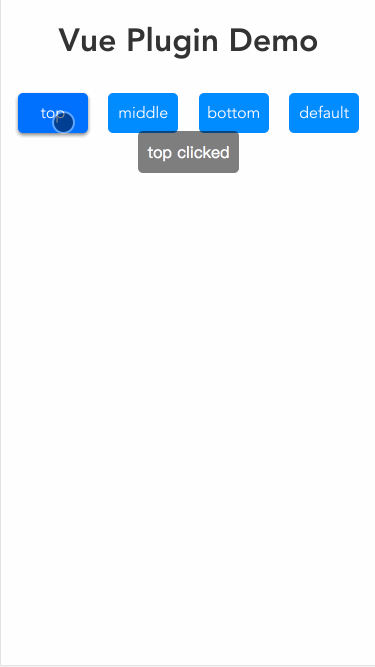

# test-vue-plugin

This is a demo for learn vue plugin

## Usage
```js
// main.js
import Toast from '@/plugins/toast'
Vue.use(Toast, {
  position: 'bottom', // set default position
  duration: 800 // set default duration
})

// use in vue page
this.$toast('tip')
```

## Effect
